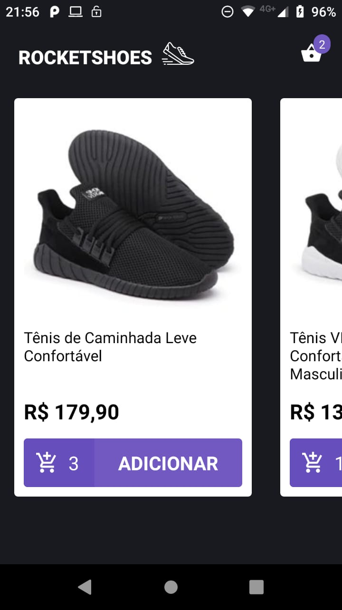
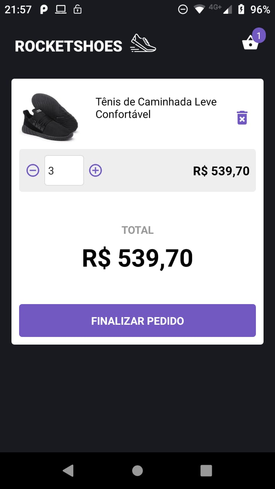
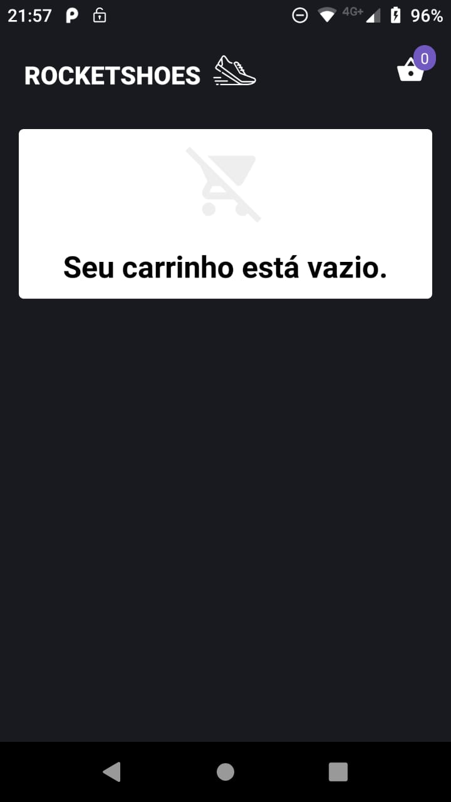

# RocketShoes App - #07 and #08 Bootcamp Challenge

**React Native App** using **Redux**, **Styled Components** and **Axios**.

This App serves like a **virtual store**. It can handle **API requests** while trying to **add some product** to cart, **e.g checking the available stock before adding an item in the cart**.

**Redux and Redux Saga** for handling **global states** and **user actions**.
**Axios** for **sending requests to the fake API**.

This project is **currently** using **React Hooks**.

## Running

Clone the repository.

```bash
git clone https://github.com/guilhermerodz/rocketshoes-app
```

Install the application in your device:

```bash
react-native run-android
```

or

```bash
react-native run-ios
```

Run the following commands to run the server:

```bash
yarn start
```

## Challenge Result






